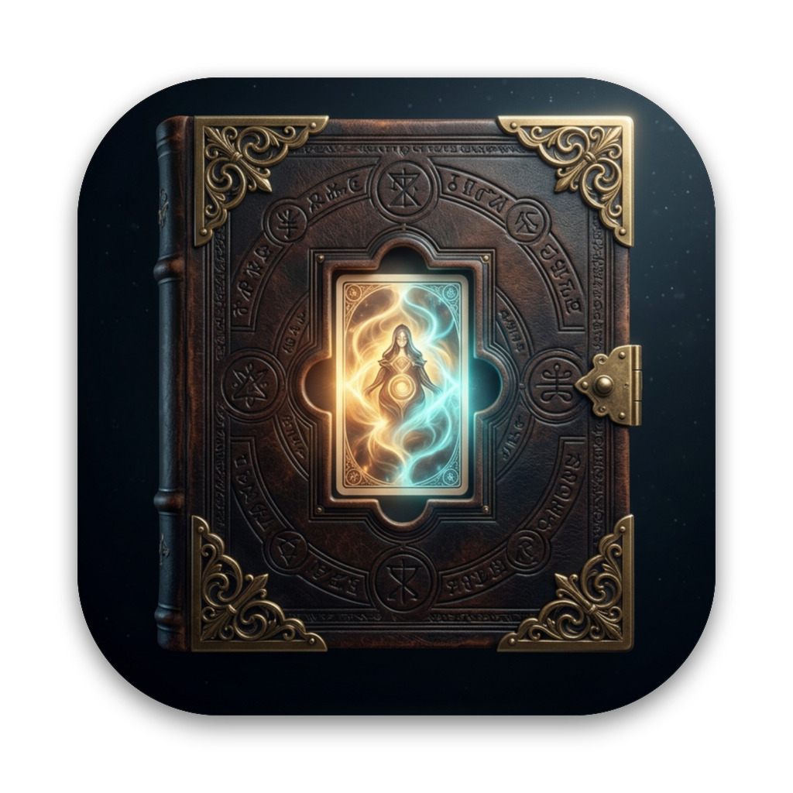
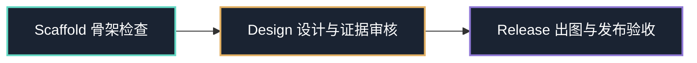

<p align="center">
  
</p>

<h1 align="center">诡秘世界 · World of Mysteries</h1>

<p align="center">
  <strong>《诡秘世界》前置工程 · 内容生产（22 条成神途径 × 序列 9–0 的序列卡）+ macOS 原生画册客户端 + 未来引擎层（占位）</strong>
</p>

<p align="center">
  <a href="https://github.com/hrygo/world-of-mysteries/actions/workflows/ci.yml"></a>
  
  
  
  
  <a href="LICENSE-CODE.md"></a>
</p>

<p align="center">
  <a href="#-项目核心目标">核心目标</a> ·
  <a href="#-核心亮点">核心亮点</a> ·
  <a href="#-快速开始">快速开始</a> ·
  <a href="#-六维语义契约">六维契约</a> ·
  <a href="#-愚者途径研究资料">研究资料</a> ·
  <a href="#-原生画册客户端-worldofmysteries">画册客户端</a> ·
  <a href="#-工程目录结构">工程目录</a> ·
  <a href="#-三级质量保证门槛">质量门槛</a> ·
  <a href="#-参与贡献">参与贡献</a> ·
  <a href="#-版权与法律边界">权利边界</a>
</p>

---

## 📖 项目定位

本仓库是《诡秘世界》的**前置工程**，同时承载三个面：

| 面 | 状态 | 位置 |
|---|---|---|
| **内容生产面** | 进行中（仅愚者途径做深） | `pathways/`、`catalog/`、`sources/`、`production/`、`tools/` |
| **客户端面** | M1 垂直切片（隔离 fixture） | `apps/WorldOfMysteries` |
| **引擎面** | **未实现**（契约占位） | `packages/` |

制作卡片的能力只是内容层的一个子域，不是本仓库的全部。分层与依赖方向见 [`docs/architecture/layering.md`](docs/architecture/layering.md)；不做物理迁移的依据见 [`docs/decisions/ADR-006-docs-first-layering-no-physical-migration.md`](docs/decisions/ADR-006-docs-first-layering-no-physical-migration.md)。

《诡秘世界》的产品目标（World/Character/Story/Audio 引擎、持久世界、Story Book）以 [`docs/product/secret-world-prd-v1.0.md`](docs/product/secret-world-prd-v1.0.md)（母 PRD，**立项级产品基线**）为准：它约束**未来**实现，**不是**本仓库现有交付面的规范，也不构成批准；其中引擎能力均未实现。

220 是美术生产脚手架的序列卡槽基线（22 途径 × 10 序列），不是卡牌上限，也不是客户端收藏分母——同一序列可有多个不同人物的身份卡，同一人物可有跨多个序列的形象卡，实际卡数可超过 220。客户端模型允许一个序列拥有 0…N 张身份卡，
同一角色也可以拥有多张独立身份卡；当前客户端以隔离 fixture 展示 S00 愚者先生、S09 克莱恩、序列之上·诡秘之主的福生玄黄天尊、序列之上·星界支柱的上帝与序列之上·现实支柱的堕落母神，以及永恒之暗、恶魔之父、毁灭天灾、失序者、知识之妖、光之钥六位「序列之上」旧日，共十一张卡，均已接入卡图、六维、故事与本地配音；十一张卡已于 2026-09-14 由用户视觉验收并在客户端呈现为正式收藏，但内容仍是待核验 fixture，也没有 2K/4K 交付像素——批准不等于发布。

> **核心哲学**：
> **六维语义完整，载体自由组合；艺术可以抽象，事实不能含混。**

每张牌必须涵盖六大核心维度：**身份 — 扮演 — 能力 — 魔药 — 晋升 — 限制**。
我们不做刻板生硬的六格卡牌模版，也不做毫无依据的纯空想插画；默认采用序列原型，杜绝将角色偶然外物或高序列力量提前嫁接。

跨途径层级称谓统一从 `config/sequence-hierarchy.json` 读取：当前第五纪序列9–8为低序列、序列7–5为中序列、序列4–1为高序列/半神；序列4–3通常称圣者，序列2–1通常称天使，序列0为真神。天使之王是超越普通序列1但尚未成为真神的状态，不是新的序列；序列0卡也仍是正式序列卡，不是特殊事件。

---

## ✨ 核心亮点

- 🎴 **220 独立卡位与差异化视觉语言**
  在形状、材质、构图和异常发生方式上严格区分 22 条途径，拒绝千篇一律的站姿与触手堆砌。
- ⚡ **零依赖工程化工具链 (`tools/cardctl.py`)**
  仅依赖 Python 3.10+ 标准库，不联网、不请求外部 API、不偷跑收费模型，提供完整的脚手架结构验证、任务编译与状态追踪。
- 🛡️ **严格的事实与创作分离**
  正典断言（原著事实）、资料缺口（诚实记录未知）、解释性概括与美术提案严格解耦，拒绝为凑完成率捏造配方与仪式。
- 🔒 **三级渐进式发布阻断流水线**
  `scaffold`（结构骨架）➔ `design`（六维转译与证据）➔ `release`（真实高清图档与审核快照），层层设卡杜绝劣质打卡。
- 🖥️ **原生 macOS 卡牌画册客户端 (`apps/WorldOfMysteries`)**
  基于 SwiftUI 的 macOS 原生 M1 里程碑垂直切片，提供书架画廊、正式/候选/愿望清单、故事抽屉、人工台词审核门槛及本机 SpeechRail 语音接入。

---

## 🚀 快速开始

### 1. 环境准备

- **内容生产工具链**：Python 3.10 或更高版本（纯标准库，无需 `pip install`）。
- **macOS 画册客户端**（可选）：macOS 26.0+，Swift 6.2+ 工具链；当前在 Apple silicon arm64、Swift 6.3.3 环境验证。

### 2. 基础检查与工作流体验

所有命令均在仓库根目录执行：

```bash
# 1. 验证脚手架 220 个卡位与基础结构完整性
python3 tools/cardctl.py check --level scaffold

# 2. 查看全局 22 途径制作状态总览
python3 tools/cardctl.py status

# 3. 智能推荐下一张待制作卡牌
python3 tools/cardctl.py next

# 4. 编译单卡研究草稿任务单（以愚者途径序列 9 占卜家为例）
python3 tools/cardctl.py brief --card fool:09 --draft

# 5. 执行工程自动化测试套件
python3 -m unittest discover -s tests -v
```

> [!NOTE]
> 刚检出的脚手架在执行 `check --level design` 或 `check --level release` 时**应当失败**：当前卡位仍处于研究待填补阶段，这属于发布阻断机制的正常表现，而非代码故障。

---

## 📐 六维语义契约

卡面上的每一个视觉元素都承担着严谨的信息回读职责。每张牌必须涵盖六大核心维度：
**身份 (Identity) — 扮演 (Acting) — 能力 (Abilities) — 魔药 (Potion) — 晋升 (Advancement) — 限制 (Limitation)**。

我们不做刻板生硬的六格模板，也不做毫无依据的纯空想插画；默认采用序列原型，杜绝将角色偶然外物或高序列力量提前嫁接。各维度的具体表达事实、核验边界、载体示例与误读阻断底线详见规范文档：
👉 [六维语义契约 (design/semantic-contract.md)](design/semantic-contract.md)

---

## 📚 设定研究与资料索引

本工程采用“研究稿 — 正典断言 — 来源登记”三层资料体系：
- 🗃️ [结构化正典断言库 (pathways/fool/canon.json)](pathways/fool/canon.json)：已核验的序列名称、能力、配方、扮演、晋升与资料缺口，按证据状态严格管理。
- 🔗 [来源登记与证据范围 (sources/registry.json)](sources/registry.json)：记录官方中文底本、官方英文交叉定位及二手研究来源的访问状态与使用边界。
- 📑 [途径研究稿与单卡资料包索引 (docs/research/README.md)](docs/research/README.md)：汇集魔药配方与扮演法考据、克莱恩/愚者先生/格尔曼·斯帕罗/扎拉图/安提哥努斯等角色与单卡阶段性资料包。

> [!NOTE]
> 研究稿用于阶段性考据与信息整理，未完成原著核验前保持 `lead` 或 `knowledge_gap` 标记，不代表卡牌已通过 `design` / `release` 门槛。

---

## 🖥️ 原生画册客户端 (WorldOfMysteries)

位于 [`apps/WorldOfMysteries`](apps/WorldOfMysteries/)，是《诡秘世界》卡牌画册的原生桌面客户端：

<p align="center">
  
</p>

### 当前能力
- 📚 **书架画廊**：M1 fixture 展示十一张隔离卡（S09 克莱恩、S00 愚者先生、福生玄黄天尊、上帝、堕落母神，以及永恒之暗、恶魔之父、毁灭天灾、失序者、知识之妖、光之钥），模型为动态 0…N 预留。
- 🗂️ **三类清单**：正式收藏、候选收藏和愿望清单分开筛选；候选不会因内容确认自动升级。十一张示意卡当前均归入正式收藏，内容核验状态由卡片自身标注另行表达。
- 🔍 **大卡面与详情抽屉**：展示身份面板、六维语义回读和第三人称故事；故事抽屉按正常布局流展开，不覆盖右侧面板。
- 🎙️ **SpeechRail 接入**：只连接本机 loopback `http://127.0.0.1:8201`；最新 S00/S09 各接入 6 条新版文案和对应系统音色本地 WAV，优先本地播放，缺失时才请求语音，服务失败时保留文字稿并显示失败状态。
- 🛡️ **人工审核门槛**：只有批准摘要仍与文本匹配的台词/章节进入播放列表，示意 fixture 不代表正典批准。

当前本机 Release 已发布并安装至 `/Applications/诡秘世界.app`；发布验证覆盖资源白名单、arm64 架构、macOS 26.0 最低版本、代码签名、自动化测试和真实窗口交互。这里的 App 发布不等同于卡牌的视觉正式 release。
当前未实现：仓库内容导入、SwiftData 用户库、Keychain 设置界面、完整音频缓存、正式卡面资源和卡牌游戏规则。

### 运行与构建
```bash
cd apps/WorldOfMysteries

# 运行客户端单元测试（用例数随里程碑变动，以 swift test 实际输出为准）
swift test

# 运行 SwiftPM executable
swift run WorldOfMysteries

# 构建 macOS 原生应用程序包（参数只能是 debug 或 release）
./scripts/build-app.sh debug
./scripts/build-app.sh release
open .build/诡秘世界.app
```

若 `Resources/AppIcon.icns` 存在，打包脚本会将其复制到 `.app`；卡图与音频不在仓库内重复存放，打包脚本按登记表在打包期从 `artifacts/**` 拷入 `.app`（`tools/production.py stage-app-resources`）；图标不是测试运行的前置条件。
真实构建、视觉验收和 SpeechRail 试听状态见 [`apps/WorldOfMysteries/docs/qa/m1-local-run.md`](apps/WorldOfMysteries/docs/qa/m1-local-run.md)。

---

## 📂 工程目录结构

以下列出全部顶层条目及其所属层（依据 [`docs/architecture/layering.md`](docs/architecture/layering.md)）：

```text
.
├── AGENTS.md                         # 文档层：全局质量契约与底线准则
├── apps/AGENTS.md                    # 应用层：客户端目录增量规则
├── catalog/pathways.json              # 内容层：22 条途径工作 ID 与待核验中文标签
├── config/project.json               # 内容工艺层：交付规格与全局配置入口
├── config/sequence-hierarchy.json    # 内容工艺层：9–0 层级标签单一配置（半神/圣者/天使/天使之王/真神）
├── design/                           # 内容工艺层：六维转译、美术总纲、版式与审核规范
├── docs/                             # 文档层：架构决策、工作流、证据来源策略
│   ├── START-HERE.md                 # 制作快速上手指南
│   ├── workflow.md                   # 阶段推进流转说明
│   └── DECISIONS.md                  # 架构设计决策记录 (ADR)
├── pathways/                         # 内容层：22 途径核心资产
│   └── <pathway_id>/
│       ├── direction.json            # 该途径原创视觉提案
│       ├── canon.json                # 已核验设定断言库
│       └── sequences/<09..00>/
│           └── card.json             # 单卡唯一六维结构化设计方案
├── sources/                          # 内容层：来源登记与证据范围
├── apps/WorldOfMysteries/              # 应用层：macOS 原生卡牌画册客户端 M1 里程碑垂直切片
│   ├── Package.swift                  # SwiftPM targets 与 macOS 平台声明
│   ├── Sources/                       # Core、Features 与 @main 入口
│   ├── Tests/                         # 客户端领域/交互测试
│   ├── Resources/Info.plist           # .app 元数据（图标资源可选）
│   ├── scripts/build-app.sh            # debug/release .app 打包
│   └── docs/qa/                       # 本机运行与视觉验收记录
├── tools/cardctl.py                   # 制造层：核心命令行工具（检查、状态、编译、校验）
├── production/                        # 制造层：分层生产记录与门禁
├── artifacts/                         # 制造层：不可覆盖的 raw/final/preview/provenance
├── generated/                         # 制造层：brief 等派生输出
├── reports/                          # 制造层：验收报告与覆盖率核对记录
├── references/                       # 制造层：参考资料登记
├── schemas/                          # 内容工艺层：JSON Schema 结构约束
├── templates/                        # 内容工艺层：任务模板
├── examples/                         # 内容工艺层：内容工艺模式参考（如方向研究示例、六维转译模式）
├── prompts/                          # 内容工艺层：研究/美术/审核提示词模板
├── tests/                            # 制造层：自动化回归与反例测试集
├── packages/                         # 引擎层（占位·未实现）：未来 IP 中性引擎契约
├── CHANGELOG.md                      # 仓库元数据：版本变更日志
├── CONTRIBUTING.md                   # 仓库元数据：贡献指南
├── CODE_OF_CONDUCT.md                # 仓库元数据：行为准则
├── SECURITY.md                       # 仓库元数据：安全政策
├── SUPPORT.md                        # 仓库元数据：支持与问题分流
├── LICENSE-CODE.md                   # 仓库元数据：MIT 许可证
├── NOTICE.md                         # 仓库元数据：内容协议与版权边界
├── README.md                         # 仓库元数据：本文件
├── .agents/                          # 仓库元数据：Agent 技能（card-production-sop｜foundation｜hierarchy｜subject｜symbols｜quality-frames）
└── .github/                          # 仓库元数据：CI 与 PR/Issue 模板
```

> `examples/` 存放内容工艺的模式参考（如方向研究示例、六维转译模式），`prompts/` 存放研究/美术/审核提示词模板；二者服务内容生产，不含事实源。

---

## 🚦 三级质量保证门槛



1. **`check --level scaffold`（结构级）**：
   核查 22 条途径、220 个序列槽位、Schema 完整性、引用合法性与路径越界防范。
2. **`check --level design --card <id>`（设计级）**：
   核验单卡原著证据链、六维载体完整性、误读阻断声明与艺术缺口记录。
3. **`check --level release --card <id>`（发布级）**：
   校验成品图像的物理分辨率、真实色彩通道、文件哈希一致性以及人工批准签署。

客户端另有独立门槛：`swift test`、debug/release `.app` 构建，以及一次真实窗口验收。
客户端验收不等于 220 张卡牌的 design/release 通过；当前 M1 只证明示意 fixture、布局和失败回退可运行。

---

## 🤝 参与贡献

欢迎共同完善《诡秘世界》前置工程的内容生产、客户端与未来引擎层！在提交 Pull Request 前，请参阅：

- 📘 [贡献指南 (CONTRIBUTING.md)](CONTRIBUTING.md)：完整的单卡研究、证据填写与提交约定。
- 🛡️ [安全政策 (SECURITY.md)](SECURITY.md)：私密报告漏洞或凭据风险。
- 📜 [行为准则 (CODE_OF_CONDUCT.md)](CODE_OF_CONDUCT.md)：社区协作与沟通规范。
- 💬 [支持与问题分流 (SUPPORT.md)](SUPPORT.md)：提交需求、反馈与讨论渠道。

---

## ⚖️ 免责声明与版权边界

- **同人衍生作品**：本项目为《诡秘之主》读者发起的非盈利粉丝同人开源工程，非官方商业授权产品。
- **知识产权归属**：《诡秘之主》小说世界观、专有名词、设定及相关角色著作权归原著作者 **爱潜水的乌贼** 及 **阅文集团（起点中文网）** 所有。
- **无原著全文**：本仓库严禁录入小说正文全文，所有引用仅限于设定考据与单句事实考证。
- **开源许可证**：本项目软件代码、命令行工具与脚本采用 [MIT 许可证](LICENSE-CODE.md) 开源；内容协议与设计版权边界详见 [NOTICE.md](NOTICE.md)。
